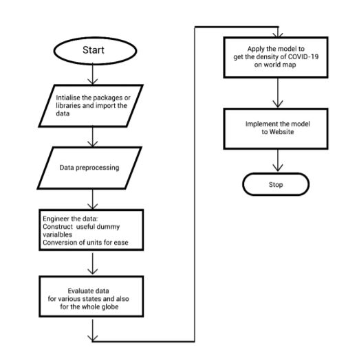

**PROBLEM STATEMENT:**

Performing Statistical Data analysis on Covid-19 dataset and drawing conclusion in R.
The number of COVID-19 cases in India is increasing at a rapid pace. The National and local
authorities are having a hard time to create a pattern, analyze and forecast the spread of COVID19 in India. The main aim of this paper is to draw a statistical model for better understanding of
COVID-19 spread in India by thoroughly studying the reported cases in the country till 22 April
2020. An Exploratory Data Analysis (EDA) technique is being implemented to study and
analyze the reported COVID-19 cases in India. The result of the analysis divulges the impact of
COVID-19 in India on daily and weekly manner, analogize India with abutting countries as well
as with the countries who are badly affected and arrangement of India's Healthcare sector for
such epidemic. 

**Detailed Design**

